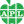
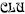
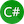
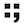
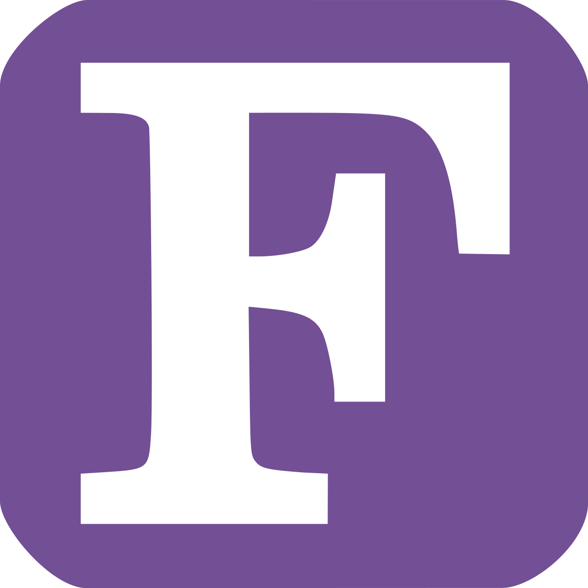
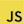
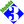
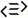
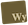

# Programming Language Explorations

A collection of illustrative examples in close to 100 programming languages, including every code snippet used in each edition of the book [Programming Language Explorations](https://rtoal.github.io/ple).

                                                                                                                      

Most of the programs in this repo can be run at [Replit](https://replit.com) or [JDoodle](https://www.jdoodle.com/). Many can also be run at [TIO](https://tio.run), [OneCompiler](https://onecompiler.com/), or [Attempt this Online](https://ato.pxeger.com/about). Many languages feature their own ”official” online playgrounds, notably [Rust](https://play.rust-lang.org/), [Go](https://play.golang.com/), [TypeScript](https://www.typescriptlang.org/play), and [Haskell](https://play.haskell.org/).

You are welcome to clone this repository and run the examples locally on your own machine. See the specific README files within the language sub folders for instructions running the examples this way. You'll generally have to first download and install a language implementation for your particular operating system and architecture; such information is generally available online, but the individual language READMEs will often have pointers. Look in each folder for a test runner named _test.sh_ for Bash and _test.ps1_ for PowerShell.

The README files in each programming language folder contain language information and links to various resources for you to continue your study of the language or contribute to open source projects featuring the language.

For quick reference information on the languages covered in this project, visit our [Language Overviews](https://rtoal.github.io/ple/overviews.html). Source code for this little browser can be found in the docs folder of this repo.
